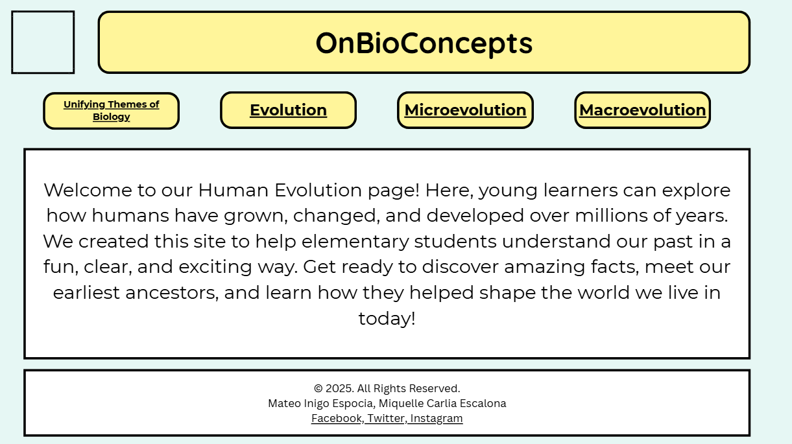
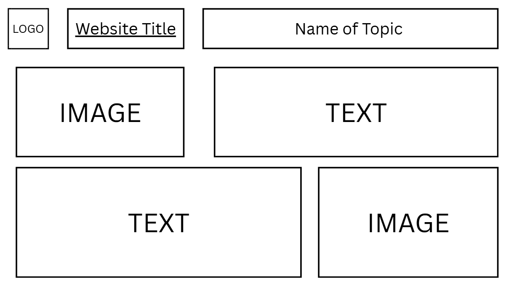
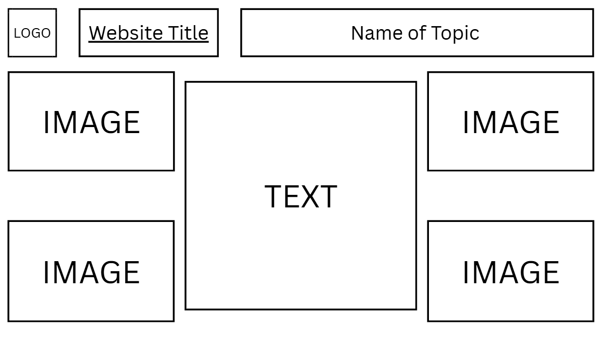

# CS Project (Rb07, Rb09)
## by ESPOCIA, Mateo and ESCALONA, Maxxi

## Short Description

This website explores human evolution in a fun and engaging way for elementary students. Our goal is to help young learners understand how humans have changed and improved over millions of years, from our earliest ancestors to who we are today. We explain big ideas using simple words and clear examples. Students can discover cool facts about early humans and how they survived. This page will inspire curiosity and make learning about our past more fun.

# Webpages

## About

## Lessons:

We will have individual web pages for each lesson:

- Topic 1: Unifying Themes of Biology
- Topic 2: Darwin's Theory of Evolution
- Topic 3: Macroevolution
- Topic 4: Microevolution

## Wireframes

## More Advanced Lessons

**Planning in JS**:

Javascript will be used by using GeoGebra for the ano.